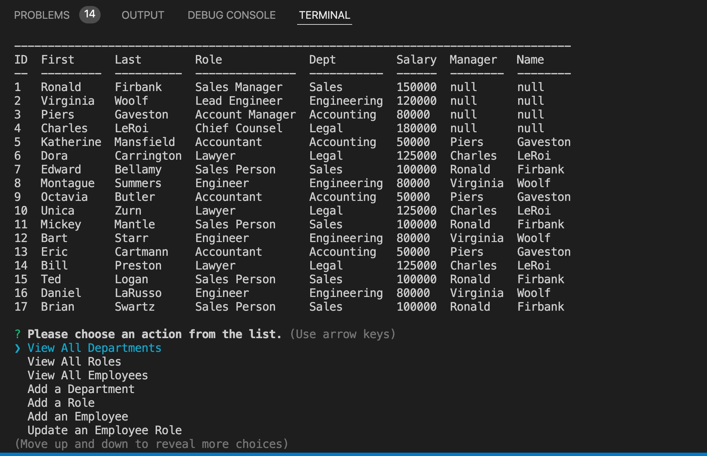

# [Welcome to Employee Tracker](https://github.com/bdswartz/employee-tracker)

#### Employee Tracker is a mySQL2 database with a command line prompt based interface.  It allows a business owner or manager to view and manage the departments, roles, and employees in their company so that they can plan and organize their business.  

---

#### Collaborators:
* [Brian Swartz](https://github.com/bdswartz)

---

## Installation
npm i

---

## Usage
Type "node index.js" while in the root directory of the application files

[Usage Video](screen-recording.mov "Usage Video")

---

## Technologies

> <b>Development Tools:</b>
  * node.js
    * [inquirer package](https://www.npmjs.com/package/inquirer)
    * [mySQL2 package](https://www.npmjs.com/package/mysql2)
    * [console.table package](https://www.npmjs.com/package/console.table)
  * JavaScript
  * SQL

  ---

## User Story
### AS A small business owner
AS A business owner
I WANT to be able to view and manage the departments, roles, and 
employees in my company
SO THAT I can organize and plan my business
    
### Acceptance Criteria for Minimum Viable Product

GIVEN a command-line application that accepts user input
*  WHEN I start the application
    THEN I am presented with the following options: view all departments, view all roles, view all employees, add a department, add a role, add an employee, and update an employee role
*  WHEN I choose to view all departments
    THEN I am presented with a formatted table showing department names and department ids
*  WHEN I choose to view all roles
    THEN I am presented with the job title, role id, the department that role belongs to, and the salary for that role
*  WHEN I choose to view all employees
    THEN I am presented with a formatted table showing employee data, including employee ids, first names, last names, job titles, departments, salaries, and managers that the employees report to
*  WHEN I choose to add a department
    THEN I am prompted to enter the name of the department and that department is added to the database
*  WHEN I choose to add a role
    THEN I am prompted to enter the name, salary, and department for the role and that role is added to the database
*  WHEN I choose to add an employee
    THEN I am prompted to enter the employee’s first name, last name, role, and manager, and that employee is added to the database
*  WHEN I choose to update an employee role
    THEN I am prompted to select an employee to update and their new role and this information is updated in the database

---
## Features
-  User input directs thee user to prepared SQL queries.
-  Provides dynamically populated user input lists to aid the user.

---

## Questions
Please visit my GitHub page
at https://github.com/bdswartz

If there are any questions about the project,
feel free to open an issue or contact me at briandswartz@outlook.com